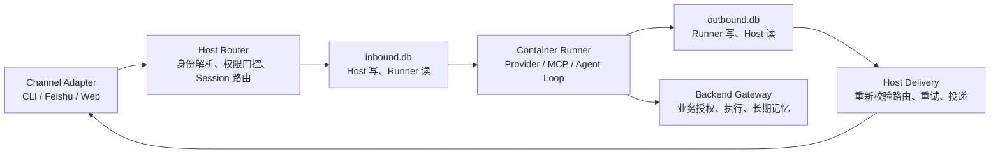

# AgentDesk 代码关键细节与改动检查清单

> 文档快照：2026-08-20
>
> 适用对象：新接手项目的开发者、代码评审者、生产运维人员，以及准备项目技术面试的人。
>
> 本文不重复产品功能清单，重点解释代码中不容易从目录结构看出的承重设计、风险边界和验证方法。

## 1. 阅读这套代码时，先建立什么心智模型

AgentDesk 不是一个把模型 API 包在聊天界面里的应用，而是一套多用户、多入口、容器化执行的企业 Agent 平台。它把一次消息处理拆成了几个边界清晰的阶段：



核心判断原则只有一句话：**Host 掌握可信身份和最终路由权，Runner 负责 Agent 执行，Backend Gateway 掌握业务授权和长期业务数据。**

一条完整消息链路大致是：

1. Channel Adapter 将外部事件标准化为 `InboundEvent`。
2. Host 持久化入口事件，解析用户、组织、群组和 Agent 绑定关系。
3. Host 执行访问门控，选择或创建 Session，并将消息写入该 Session 的 `inbound.db`。
4. Session Manager 按需启动容器；Runner 从 `inbound.db` 领取消息并调用模型、工具或 Gateway。
5. Runner 将结果写入 `outbound.db`。
6. Host Delivery Loop 读取结果，重新校验目标，调用 Channel Adapter 投递，并记录成功、重试或停放状态。
7. Host Sweep 负责崩溃恢复、处理状态回收、容器健康检查和过期数据清理。

入口可从 [src/index.ts](../src/index.ts)、[src/router.ts](../src/router.ts)、[src/session-manager.ts](../src/session-manager.ts)、[container/agent-runner/src/poll-loop.ts](../container/agent-runner/src/poll-loop.ts)、[src/delivery.ts](../src/delivery.ts) 和 [src/host-sweep.ts](../src/host-sweep.ts) 串起来阅读。

## 2. 事实来源的优先级

项目文档较多，而且代码仍在演进。判断当前行为时建议按下面的优先级交叉验证：

1. 当前类型定义、数据库 Schema、运行时代码和自动化测试；
2. [ADR 索引](decisions/README.md)及相应决策记录，用于解释“为什么这样设计”；
3. 具体专题文档，例如 [数据库模型](db.md)、[隔离模型](isolation-model.md)、[企业 Gateway](enterprise-erp-gateway.md)；
4. README、平台总览、开发指南等宽口径文档。

宽口径文档适合建立全貌，但其中的迁移数量、接口片段或表归属可能落后于实现。改代码前应以 Schema、测试和 ADR 再确认一次，不要只根据一段旧示例推导运行时契约。

## 3. 八条不能轻易破坏的承重不变量

### 3.1 三库单写：不是普通的数据拆分，而是并发协议

系统存在三类 SQLite 数据库：

| 数据库         | 典型位置                                         | 写入所有权                                    | 主要用途                                                      |
| -------------- | ------------------------------------------------ | --------------------------------------------- | ------------------------------------------------------------- |
| 中央数据库     | `data/v2.db`                                     | Host                                          | 用户、组织、角色、Agent Group、Session 元数据、审计、Web 状态 |
| Session 入站库 | `data/v2-sessions/<group>/<session>/inbound.db`  | Host                                          | 输入消息、已投递标记、路由投影、Roster、投递回执              |
| Session 出站库 | `data/v2-sessions/<group>/<session>/outbound.db` | Runner 为原则写入方；当前存在 Host 直写快路径 | Agent 输出、处理确认、Session/容器状态                        |

需要特别关注：

- 中央库和 `inbound.db` 只能由 Host 写；`outbound.db` 的架构所有者是 Runner。当前 `writeOutboundDirect()` 为命令拒绝响应提供了一个竞争式 Host 直写例外，属于需要重点约束、而非可以继续扩大的通道。
- Session 库采用 SQLite `journal_mode=DELETE`，并遵循 **open-write-close**。这是为跨容器挂载的可见性和可靠性服务，不是可以随意替换的性能细节。
- Host 不通过修改 `outbound.db` 表示“已投递”，而是在 `inbound.db.delivered` 中记录回执。
- Runner 不直接修改 `messages_in` 的最终处理状态，而是写 `outbound.db.processing_ack`，再由 Host Sweep 同步回 `inbound.db`。
- Host 正常写入的 `messages_in.seq` 使用偶数，Runner 正常写入的 `messages_out.seq` 使用奇数。奇偶约定主要用于跨表定位编辑、回应和反应目标；当前 Host 直写出站快路径会生成偶数出站 seq，见第 7 节的风险说明。

因此，“把两个 Session 库合成一个库”“开启 WAL 提升性能”“让读取方继续增加回写状态”都不是局部优化，会直接改变跨进程一致性模型。现有 Host 直写例外也不能反向证明多写方是安全的。

相关实现：[src/db/session-db.ts](../src/db/session-db.ts)及其测试。

### 3.2 身份信任链：模型看到的用户 ID 不能自己推断

可信身份从 Channel Adapter 开始，由 Host 固定并贯穿整个请求：

```text
Channel 已认证用户
  → InboundEvent.authenticatedUserId
  → Host 写入 origin_user_id
  → Runner 解析本批 RequestIdentity
  → MCP / Gateway 请求携带身份
  → Gateway 授权与 gateway_audit
```

其中几个容易忽视的点：

- `senderIdentity` 与消息文本分离；不能让模型从“我是管理员”这类文本中推断权限。
- Runner 按用户和消息表面拆分批次，并从当前批次中第一条真正触发执行的聊天消息锚定 `RequestIdentity`。
- 所有 MCP 工具读取同一轮固定的 `RequestIdentity`；轮次结束必须在 `finally` 中清除，避免串到下一位用户。
- `requesterSource=agent-asserted` 表示缺少直接用户上下文，应由 Gateway 对敏感写操作保守拒绝。
- A2A 消息中的 `origin_user_id` 来自容器输出，天然不可信。Host 会把它与源 Session 的 Host 写入站记录交叉验证，不能只相信 Worker 的声明。
- 身份链最终还要落到 HMAC 签名和 `gateway_audit`，否则无法证明是谁、通过哪个 Agent、执行了什么业务动作。

任何批处理并发化、流式插入、A2A 转发或工具上下文重构，都要优先证明不会造成 Alice 的身份进入 Bob 的工具调用。

相关实现：[container/agent-runner/src/request-identity.ts](../container/agent-runner/src/request-identity.ts)、[container/agent-runner/src/poll-loop.ts](../container/agent-runner/src/poll-loop.ts)、[src/delivery.ts](../src/delivery.ts)、[src/gateway-signing-proxy.ts](../src/gateway-signing-proxy.ts)。

### 3.3 权限分层：Host 管“能不能接触 Agent”，Gateway 管“能不能做业务操作”

系统故意没有设计成一个万能 RBAC：

| 权限问题                             | 权威判断方      | 典型依据                                 |
| ------------------------------------ | --------------- | ---------------------------------------- |
| 用户能否进入某个 Agent Group         | Host            | 用户、角色、Group、Organization 成员关系 |
| 某个 Session/Lane 是否属于当前用户   | Host            | Session owner、Lane owner、当前访问门控  |
| Agent 能否访问某业务对象或执行某操作 | Backend Gateway | 后端业务权限、对象状态、业务策略         |

组织隔离尤其容易写错：

- 一个 Agent Group 归属 Organization 后，跨组织访问必须在 Host 入口拒绝。
- `organization_members` 代表可达性，不自动代表管理员权限。
- `public` Group 在有组织归属时，含义是“组织内公开”，不是全平台公开。
- Organization 不能作为 Gateway 的业务授权输入；Gateway 不应承担平台多租户边界。
- `user_roles` 每行只允许一个作用域轴：global、group 或 organization。
- 撤销 global 角色时必须保留 `organization_id IS NULL` 等完整条件，避免误删其他作用域授权。
- NULL Organization 是兼容旧数据的语义，不应被新逻辑静默扩大。

相关实现：[src/modules/permissions/access.ts](../src/modules/permissions/access.ts)、[ADR-0052：多租户组织隔离](decisions/ADR-0052-multi-tenant-org-isolation.md)。

### 3.4 容器输出零信任：能写 `outbound.db` 不等于有投递权

Runner 可以提出“把消息发给谁”“以谁的身份调用 Gateway”“发起什么确认”，但不能做最终决定。Host 在消费容器输出时必须重新派生或验证：

- 普通聊天输出只能回到可信入站消息对应的会话地址。
- 额外目标必须存在于中央库的 `agent_destinations` ACL 中。
- A2A 目标要验证目标 Agent、组织边界、根 Session 和最大派生深度。
- 用户身份声明要与源 Session 的可信入站身份交叉验证。
- Confirmation 的请求人和回传地址要从 Host 数据重新派生，不能接受容器自报。
- Web 中的卡片或动作载荷不能直接变成任意后端操作。

`inbound.db.destinations`、`session_routing` 等表只是为 Runner 提供的快照或投影，不是授权权威。即使投影已过期或被错误读取，最终投递门仍在 Host。

### 3.5 Session、Container、Lane、Thread 不是同一个概念

项目中多个 ID 看起来都像“会话”，但生命周期和安全含义完全不同：

| 标识                     | 实际含义                            | 能否作为授权依据                          |
| ------------------------ | ----------------------------------- | ----------------------------------------- |
| `messaging_group_id`     | 某个 Channel 上的群、私聊或地址抽象 | 只能作为路由输入，仍需访问门控            |
| `session.id`             | 持久化 Agent 执行上下文             | 需要结合 owner、group 和访问门控          |
| `root_session_id`        | 一棵 A2A 委派树的根                 | 用于关联和隔离 Worker，不替代用户授权     |
| `conversation_lane_id`   | 用户拥有的跨 Channel 连续对话结构   | 必须校验 Lane owner 与 Agent Group 访问权 |
| `conversation_thread_id` | 可观测性/追踪相关 ID                | **绝不能用于授权或路由**                  |
| `source_session_id`      | A2A 直接返回路径                    | 用于回到委派来源，不代表调用者身份        |
| `in_reply_to`            | 本轮输出对应的可信入站行            | 可帮助 Host 重新派生当前回复地址          |

此外：

- Session 是持久的；Container 是按需启动、可反复销毁重建的执行载体。
- shared、per-thread、agent-shared、per-user、per-user-per-thread 五种 Session 模式不能混用默认假设。
- 用户作用域模式缺少可信用户身份时应拒绝创建，不能退化成共享 Session。
- shared Session 不会因为启用 Lane 自动变成用户私有 Session。
- 同一用户与 Agent Group 可以存在多条 Lane，不能把 Lane 当作天然唯一键。
- 跨 Channel 回复目标必须根据当前入站消息重新派生，不能沿用 Session 里一个陈旧的 `messaging_group_id`。

相关实现：[src/session-manager.ts](../src/session-manager.ts)、[src/db/conversation-lanes.ts](../src/db/conversation-lanes.ts)、[src/web/conversations.ts](../src/web/conversations.ts)。

### 3.6 入口恢复、去重和业务幂等是三件不同的事

代码中存在多个“避免重复”的机制，但它们解决的问题不同：

| 机制                    | 解决的问题                                    | 不保证什么                       |
| ----------------------- | --------------------------------------------- | -------------------------------- |
| `inbound_ingress`       | Host 在路由前崩溃后保留入口事件，支持显式重放 | 不等于 Channel 事件去重          |
| `inbound_dedup`         | Adapter 对同一外部事件执行 first-seen 去重    | 不保证后端业务操作幂等           |
| `delivered`             | Host 记录某条出站消息已成功投递               | 无法完全消除网络超时后的重复发送 |
| Gateway idempotency key | 避免同一业务写操作重复生效                    | 依赖后端正确实现和持久化         |

平台总体是 **at-least-once** 思路：宁愿保留可恢复性，也不声称端到端 exactly-once。典型边界是 Channel API 已经成功发送，但 Host 在收到响应前超时；重试可能产生重复消息。因此：

- 对话输出要允许偶发重复，或由 Adapter 使用平台消息 ID 做更强去重。
- 所有有副作用的 Gateway `execute` 应使用稳定 idempotency key。
- bulk 操作中的每个子操作都应有独立的幂等语义。
- 入口重放必须由运维明确触发，不能把 recovery ledger 当作自动重复消费队列。

### 3.7 平台核心必须保持业务无关

AgentDesk Core 负责入口、Session、身份、授权边界、容器执行、Gateway 契约和投递，不负责某家企业的 ERP、CRM、实验室、Windows GUI 或飞书多维表业务规则。

边界约定：

- 通用机制放在 `src/`、`container/agent-runner/`。
- 业务拓扑、业务 Prompt 和参考后端放在 `examples/` 或部署方仓库。
- 后端差异通过 Gateway Contract 适配，不在 Router 中增加业务分支。
- 外部 Channel 扩展是运维人员信任并安装的代码，不是安全沙箱中的第三方插件。
- 显示名称和协议命名空间由 [src/branding.ts](../src/branding.ts) 集中派生，不在各模块硬编码品牌名。

判断一个需求是否应该进入 Core，可以问：**如果把后端从 ERP 换成工单系统，这段逻辑是否仍然成立？** 如果答案是否定的，它大概率属于 Gateway 或示例部署。

### 3.8 可观测性必须只读

OpenTelemetry、Phoenix、Grafana 和内部指标只能观察现有消息流，不能改变身份、路由或投递结果：

- Trace ID 不能成为权限依据。
- 埋点失败不能阻断正常消息投递。
- 全量内容采集默认关闭，避免把 Prompt、业务结果和个人信息复制到观测系统。
- Usage、Activity 等事件可以影响统计和存活判断，但不能被当成用户消息发送。

可观测性“只读”不仅是运维偏好，也是避免旁路突破身份信任链的安全边界。

## 4. 按运行链路需要关注的代码细节

### 4.1 Channel Adapter 与 Ingress

`InboundEvent` 是 Host 内部的可信事件信封，不是直接接收任意 JSON 的公共 DTO。Adapter 必须完成：

- 校验平台签名或使用受信连接获取事件；
- 标准化 `channelType`、`platformId`、`threadId`；
- 提供已认证的 `authenticatedUserId`；
- 将发送者身份与消息内容分离；
- 在进入 Router 前完成平台事件去重；
- 对附件、引用和回复关系做边界检查。

Router 采用“先写恢复账本，再处理”的顺序。路由成功后删除恢复记录；失败则保留失败状态和错误，供运维排查或显式重放。这里的设计目标是 Host 崩溃后可恢复，不是自动无限重试。

`ignored_message_policy=accumulate` 是一个非常实用但容易误解的细节：未触发 Agent 的群消息可写成 `trigger=0`，只积累上下文而不唤醒容器；下一条真正触发的消息可以一起读取。权限拒绝、安全拒绝不能以这种方式积累，否则会把本来不可见的信息带入后续上下文。

### 4.2 Router 与 Session 创建

Router 的关键顺序应保持为：

1. 规范化外部线程和群组；
2. 查找或按保守规则创建 Messaging Group；
3. 解析已认证用户；
4. 找到绑定的 Agent Group；
5. 判断消息是否触发 Agent；
6. 执行组织、角色、成员和 sender-scope 门控；
7. 解析或创建 Session；
8. 写入 `messages_in`；
9. 仅在需要执行时唤醒容器。

先创建 Session 再鉴权、先唤醒再持久化、或在 Access Gate 之前执行模型命令，都会扩大攻击面。

Session 创建是两层操作：先在中央库建立持久 Session 元数据，再初始化 Session 目录和两个 SQLite 文件。跨 Channel Lane 的根 Session 创建还需要中央事务保证 Lane、绑定和 Session 的一致性。

命令处理也有独立门控。管理员命令应在模型看到内容前拦截。当前拒绝结果由 Host 通过 `writeOutboundDirect()` 写入 `outbound.db`，避免唤醒模型；这是一个刻意的快路径，同时也是对出站库单写原则的例外，失败行为和 seq 规则需要单独测试。

### 4.3 Runner 领取、批次和 Provider

Runner 的轮询不是简单的 `SELECT pending LIMIT N`：

- 只读取达到 `next_attempt_at` 的待处理消息；
- 先声明为 processing，再进入执行；
- 按用户、Channel、平台和 Thread 拆分批次，避免不同身份共用一个请求上下文；
- 当前有流式响应时，如果新消息改变身份或消息表面，应结束当前流并把新消息留到下一轮；
- Provider Activity 事件会刷新存活信号，适配新 Provider 时不能只在文本 token 到达时报告活动；
- `push` 用户消息和 `pushSystemReminder` 的语义不同，系统提醒不应意外触发额外一次模型调用。

Provider continuation token 必须带 Provider 归属，不能把 Claude 的会话令牌交给 OpenAI，反之亦然。上下文压缩也不是所有 Provider 对称：只有 Provider 实际返回 summary 时才能写回摘要，不应假设每次 compaction 都能得到可持久化内容。

### 4.4 A2A 委派

A2A 的安全难点不在“发送一条内部消息”，而在维持原始用户身份和返回路径：

- 可委派目标来自中央 `agent_destinations`，不是模型自由填写的 Agent 名称。
- Host 重新验证 `origin_user_id`，并保留 `source_session_id` 作为直接返回路径。
- Worker Session 按 root Session 隔离，防止两棵业务对话树共享一个 Worker 上下文。
- `spawn_depth` 有上限，避免 Agent 自我递归或无限委派，默认上限为 2。
- 跨组织 A2A 必须拒绝，即使两个 Agent 之间存在配置残留。
- 附件从源 outbox 复制到目标 inbox 时需要路径和类型校验，不能允许容器提交任意宿主机路径。
- 委派和身份选择需要进入审计。

当前 Worker routing feedback 主要用于记录和评估，并不主动改变路由。这是为了避免同时存在“直接返回”和“动态重新路由”两套机制，导致重复返回或身份污染。

### 4.5 Gateway、长期记忆与确认操作

Gateway Contract 的机器真相在 [container/agent-runner/src/mcp-tools/gateway-contract.ts](../container/agent-runner/src/mcp-tools/gateway-contract.ts)。请求端应严格生成契约字段；响应端默认较宽松，以兼容不同后端，只有启用 `GATEWAY_STRICT_RESPONSES=true` 才进行严格响应验证。

需要明确的职责边界：

- Gateway 负责真实业务授权、事务、幂等和数据一致性。
- Core 只传递可信请求身份，不复制后端业务权限模型。
- 长期记忆的 get/search/upsert/feedback 都经 Gateway；Host 本地不另建业务向量库。
- 从长期记忆召回的内容是外部不可信数据，需要以带 nonce 的边界包装后再交给模型，降低 Prompt Injection 风险。
- 通用 `execute` 有稳定幂等键；memory upsert/feedback 的幂等与内容治理仍需要后端实现。

生产环境还要关注签名方式。默认情况下 Host signing proxy 没有自动开启；如果 Runner 直接持有 Gateway key，密钥会进入容器配置。启用 signing proxy 后：

- 容器只获得短期、Session 作用域代理令牌；
- Host 以请求原始字节计算签名；
- Body 声明的 Agent Group 必须和令牌的权威 Group 一致；
- 特权请求在转发前写意图审计，审计失败时应 fail closed；
- 容器自定义 Header 不会被无条件转发到业务后端。

确认操作由 Host-mediated broker 完成。Runner 只能发起受限确认意图；Host 重新解析 actor、目标、预览、过期时间和操作指纹，再向用户展示。更新/删除确认要绑定对象指纹和 patch，防止用户确认后对象或操作内容被替换。

### 4.6 Delivery Loop

Delivery Loop 是平台可靠性和安全性的第二道总闸：

- 对运行中的 Session 高频轮询，对其他活动 Session 低频兜底轮询；
- 跨 Session 有界并发，同一 Session 通过 inflight 集合避免并发 drain；
- 每条出站消息按类型分发到聊天、A2A、Roster、内部系统动作等处理器；
- 投递前用中央库重新校验目标；
- 成功后先写 `inbound.db.delivered`，再允许清理出站数据；
- 失败后持久化 attempts、错误和退避时间；
- 单条失败时停止本 Session 当前 drain，避免后面的消息越过它立即送达；
- 超过最大尝试次数后进入 parked/DLQ 状态，不能静默丢弃。

`llm-usage` 等内部记录会被标记为已处理，但不会投递给用户。增加新的出站类型时，必须明确它是用户可见消息、Host 内部控制事件，还是审计/统计数据。

### 4.7 Host Sweep 与失败恢复

Host Sweep 默认周期执行，承担“没有正常结束时谁来收尾”的职责：

- 将 `outbound.db.processing_ack` 同步到 `inbound.db`；
- 读取 container state 和 heartbeat 文件；
- 识别容器退出后仍为 processing 的消息，重置为 pending 并增加 tries/backoff；
- 超过处理尝试上限后标记失败，避免 poison message 永久循环；
- 综合 heartbeat、声明时间、工具超时和绝对上限判断卡死，而不是只依赖 PID 存活；
- 清理去重记录、代理令牌、过期确认/问题以及按配置启用的审计与 Session 数据；
- 记录可用磁盘等运行指标。

时间解析有一个细小但重要的坑：SQLite 时间戳没有时区标记时，Node 可能按本地时间解析。相关代码会补 UTC 语义，避免在非 UTC 主机上把正常处理误判为超时。修改时间字段格式时必须覆盖该场景。

### 4.8 Web、Lane 与 SSE

Web 入口并没有绕过 Host 安全模型：

- Session Cookie 为 HttpOnly、SameSite=Lax，生产环境要求 Secure；
- 写请求校验准确 Origin 和 JSON Content-Type，并设置请求体上限；
- 默认不信任 `X-Forwarded-For`，只有明确的代理信任配置才能使用；
- Lane 的列表、历史、发送和 SSE 都重新执行 owner 与 Agent Group 访问检查；
- 无权访问时使用统一 403，减少资源枚举；
- Web 发送使用 `clientMessageId` 建立幂等 receipt；
- SSE 先订阅再 replay，降低重放与实时事件之间的竞态；
- SSE 有每用户连接上限、心跳重新鉴权和背压失败处理；
- 中央 Web event 只保存消息引用，正文仍来自 Session DB，避免形成第四份消息真相。

跨 Channel Lane 默认不开启。启用后要重点验证当前回复地址来自 `in_reply_to` 对应的可信入站消息，而不是历史 Session 地址。

## 5. 最容易被忽略的实现细节速查

| 细节                                  | 为什么重要                            | 常见误改                             |
| ------------------------------------- | ------------------------------------- | ------------------------------------ |
| 正常入站偶数 seq、Runner 出站奇数 seq | 通过奇偶判断编辑/反应应查哪张表       | 新写入路径没有保持奇偶规则           |
| Session Schema 使用 lazy ALTER        | 旧 Session 文件不会走中央迁移链       | 只新增中央 migration，忘记旧 Session |
| `trigger=0`                           | 积累群聊上下文但不唤醒模型            | 当成“无效消息”直接丢弃               |
| `RequestIdentity` 按批固定            | 防止多用户工具调用串身份              | 为提高吞吐并发执行共享全局身份的批次 |
| `requesterSource=agent-asserted`      | 表明缺少直接用户依据                  | 当成普通用户请求执行敏感写入         |
| destinations 是投影                   | Runner 可发现目标，但 Host 仍最终鉴权 | 把容器可见表当权威 ACL               |
| `conversation_thread_id` 仅追踪       | 避免可伪造相关 ID 参与安全决策        | 用它查 owner、选 Session 或路由      |
| `source_session_id`                   | A2A 直接返回委派者                    | 只按最新 Session 猜返回地址          |
| success 先写 delivered                | 崩溃后可知道已送达                    | 先删 outbox 再写回执                 |
| 失败时停止当前 drain                  | 尽量维持同 Session 顺序               | 失败后继续投递后续消息               |
| Provider activity 是存活信号          | 长工具调用期间避免误杀                | 只在文本 token 到达时 heartbeat      |
| summary 由 Provider 决定              | 不同 Provider 能力不对称              | 每次 compaction 都覆盖现有摘要       |
| Gateway response 默认宽松             | 兼容部署后端                          | 误以为默认已经严格拒绝多余/缺失字段  |
| 外部 Channel 是 operator-trusted      | 扩展代码能接触 Host 权限              | 当成不可信插件直接在线安装运行       |
| 模块通过 import 注册                  | 副作用顺序影响命令优先级              | 自动排序 import 或随意合并 index     |

模块注册顺序尤其值得代码评审关注。[src/modules/index.ts](../src/modules/index.ts) 使用副作用 import 注册处理器，确认、取消、审批、权限等模块的先后会影响哪个处理器先消费命令。`response-registry` 应保持依赖轻量，避免形成初始化时序和循环依赖问题；Host Sweep 中的动态 import 也可能是为打断模块环而存在，不能只因“风格不统一”改回静态 import。

## 6. 生产默认值中需要主动决策的项目

以下配置是当前代码的保守或开发友好默认，不应把“默认关闭”误解成“系统不支持”：

| 配置/能力             | 当前典型默认                               | 上生产前要决定什么                          |
| --------------------- | ------------------------------------------ | ------------------------------------------- |
| 最大并发容器          | `MAX_CONCURRENT_CONTAINERS=10`             | 根据 CPU、内存、Provider 限流和排队时延压测 |
| 空闲容器退出          | `AGENTDESK_IDLE_EXIT_MS=0`                 | 是否回收空闲容器以控制成本                  |
| Session TTL           | `AGENTDESK_SESSION_TTL_DAYS=0`             | 数据保留、归档和合规策略                    |
| 审计保留期            | `AGENTDESK_AUDIT_RETAIN_DAYS=0`            | 合规要求与中央库体积                        |
| Session token 预算    | `AGENTDESK_SESSION_TOKEN_BUDGET_PER_MIN=0` | 是否启用成本熔断和告警                      |
| 跨 Channel Lane       | 默认关闭                                   | 是否需要跨端连续会话及其隐私边界            |
| Gateway signing proxy | 默认未开启                                 | 是否禁止 Gateway 长期密钥进入容器           |
| Gateway 严格响应      | 默认关闭                                   | 后端契约成熟后是否收紧验证                  |
| OTel 内容采集         | 默认关闭                                   | 数据脱敏、权限和保留期                      |
| 容器网络              | 默认 bridge                                | 是否建立运维方管理的 egress allowlist 网络  |

这些是部署级权衡，不应在没有迁移和运维方案时直接改成全局硬编码。

## 7. 代码热点与修改策略

### 7.1 建议优先确认的现状风险

下面几项不是抽象的“最佳实践”，而是本次对照当前实现后发现的具体关注点。它们适合进入后续技术债或架构评审，但不应在没有测试和 ADR 的情况下直接改写。

#### 优先项 A：Host 直写 `outbound.db` 与单写原则存在张力

[src/session-manager.ts](../src/session-manager.ts) 中的 `writeOutboundDirect()` 会以 500ms `busy_timeout` 打开 `outbound.db` 写入消息，目前 Router 的管理员命令拒绝路径会调用它。代码注释将其定义为“racy write”，说明实现已经承认它可能与容器写入竞争。

需要确认的风险有：

- 架构和 Delivery/Sweep 注释都把 `outbound.db` 定义为 Runner-owned、Host read-only，但此处形成第二写入方；
- Helper 注释建议 busy 时回退到常规路径，但当前 Router 只记录 `Admin deny response dropped` 后结束处理，用户可能收不到任何拒绝说明；
- 该快路径没有进入统一重试机制，SQLite busy 本身就会造成可见响应丢失；
- 后续开发者可能仿照这个例外继续增加 Host 出站写入，使单写规则逐步失效。

建议的解决方向应先通过 ADR 选择：把 Host 控制响应放入 Host-owned 队列再由 Delivery 处理；或者建立一个明确、可重试且不与 Runner 并发的控制消息通道。无论选哪种，都应新增“容器持锁时管理员拒绝仍有确定结果”的回归测试。

#### 优先项 B：seq 契约在正常路径和快路径之间不完全一致

正常路径中，Host 的 `nextEvenSeq()` 只查看 `messages_in` 生成偶数；Runner 读取入站和出站最大值生成下一个奇数。现有 `writeOutboundDirect()` 则只查看 `messages_out`，并以 `MAX(seq)+2` 写入：空表时第一条值是 2，即偶数出现在出站表。

这会带来三类需要确认的问题：

- 按奇偶选择 `messages_in`/`messages_out` 的编辑和 reaction 查询可能找错表；
- 两张表可能出现相同 seq，不能无条件声称 seq 在整个 Session 全局唯一；
- Host 下一条入站只看入站最大值，因此合并后的 seq 也不应被无条件当作严格的全局时间顺序。

短期至少应增加跨库不重复、奇偶定位、直写后继续对话的测试；长期应决定 seq 的权威定义究竟是“表定位 ID”还是“全局逻辑时钟”，并让实现、Schema 约束和 [Session DB 文档](db-session.md)保持一致。

#### 优先项 C：宽口径文档与实现存在局部漂移

例如开发指南中的 migration 数量、部分接口片段，以及某些架构文档对 Session 表归属的描述已经落后于当前代码。风险不是“文档不好看”，而是新开发者可能根据旧表归属破坏单写边界。

建议把 CI 中可机器验证的内容尽量自动生成或校验：migration 清单、Gateway schema、配置项和测试脚本；人工文档聚焦原因、约束和取舍。涉及数据库与运行时契约的 PR 应把专题文档更新列为完成条件。

#### 优先项 D：生产安全能力中有多项需要显式开启

Gateway signing proxy、严格 Gateway 响应、Session TTL、审计保留、token 预算、跨 Channel Lane、内容追踪和网络 egress 都是配置驱动。默认值本身有合理的兼容或开发背景，但部署清单如果没有显式决策，就容易形成“代码支持、生产没有真正启用”的落差。

建议维护一份环境级配置基线，并在启动时对生产环境的高风险组合给出告警，例如：业务 Gateway 已配置但 signing proxy 关闭、共享部署启用内容明文 Trace、审计和 Session 均无限保留、容器可访问任意外网。

### 7.2 高职责密度文件

下面这些文件同时承载多种职责，是变更时最需要小步提交和针对性测试的区域：

| 热点                                                                                                  | 主要职责                                      | 变更时最先保护的边界                     |
| ----------------------------------------------------------------------------------------------------- | --------------------------------------------- | ---------------------------------------- |
| [src/delivery.ts](../src/delivery.ts)                                                                 | 聊天投递、A2A、回执、重试、DLQ                | Host 最终鉴权、顺序、至少一次语义        |
| [src/container-runner.ts](../src/container-runner.ts)                                                 | 容器参数、挂载、资源、生命周期                | 单 Session 单容器、密钥、挂载权限、清理  |
| [src/router.ts](../src/router.ts)                                                                     | Ingress、用户解析、访问门控、Session 路由     | persist-before-route、组织隔离、用户隔离 |
| [src/session-manager.ts](../src/session-manager.ts)                                                   | Session 解析/创建、Lane、唤醒                 | Session 模式、owner、事务和容器上限      |
| [src/host-sweep.ts](../src/host-sweep.ts)                                                             | 崩溃恢复、超时、清理                          | processing 回收、时区、避免重复执行      |
| [src/gateway-signing-proxy.ts](../src/gateway-signing-proxy.ts)                                       | 密钥隔离、签名、审计                          | 原始字节签名、scope、fail closed         |
| [container/agent-runner/src/poll-loop.ts](../container/agent-runner/src/poll-loop.ts)                 | 批处理、身份固定、Provider 执行               | 跨用户串线、processing 状态、流式边界    |
| [container/agent-runner/src/providers/openai.ts](../container/agent-runner/src/providers/openai.ts)   | Provider 事件、工具、continuation、compaction | continuation 归属、activity、usage、摘要 |
| [container/agent-runner/src/mcp-tools/gateway.ts](../container/agent-runner/src/mcp-tools/gateway.ts) | Gateway 工具、契约、确认与记忆                | 身份、幂等、契约兼容、注入防护           |
| [src/web/conversations.ts](../src/web/conversations.ts)                                               | Lane 历史、发送、SSE                          | owner、访问门控、游标、背压              |

大文件不等于存在缺陷，但意味着一个修改更容易跨越安全、可靠性和业务三类边界。重构时优先按稳定接口拆 seam，例如把纯解析、纯校验和状态转换提取出来；不要先移动数据库写入顺序或改变调用时机，再依靠集成测试猜测是否安全。

## 8. 排障时按消息所处阶段定位

### 8.1 外部消息完全没有进入系统

依次检查：

1. Channel 连接或 Web 鉴权是否成功；
2. Adapter 是否因为签名、事件类型或 dedup 拒绝；
3. `inbound_ingress` 是否存在 received/failed 记录；
4. 用户身份是否能解析；
5. Agent Group 绑定、mention/DM 规则和访问门控是否通过。

### 8.2 Session 已创建，但容器没有执行

依次检查：

1. 消息是否为 `trigger=0`；
2. `MAX_CONCURRENT_CONTAINERS` 是否已满；
3. Session 是否 active、容器状态是否 stopped/starting；
4. 消息的 `next_attempt_at` 是否已到期；
5. Sweep 下一轮是否会重新唤醒；
6. 容器镜像、挂载、Provider 凭据和启动日志是否正常。

容器上限达到时，wake 可能返回未启动而不是抛出致命错误；这依赖后续 Sweep 重试，不应直接把 Session 判定为坏数据。

### 8.3 容器存活，但长时间没有结果

依次检查：

1. `processing_ack` 和消息 claim 时间；
2. heartbeat 文件是否更新；
3. Provider 是否持续产生 activity；
4. 是否卡在 MCP/Gateway、Bash 或网络调用；
5. 当前工具是否声明了更长超时；
6. 是否触发绝对执行上限、token 预算或 Provider 限流。

### 8.4 `outbound.db` 已有回复，但用户没有收到

依次检查：

1. 出站类型是否属于用户可见消息；
2. Host 是否因为 ACL、组织、Lane owner 或 A2A 身份验证拒绝；
3. `delivered` 是否已有回执；
4. attempts、last_error 和 next_attempt_at；
5. 是否已超过最大尝试进入 parked/DLQ；
6. Channel API 是否存在“服务端成功、客户端超时”的不确定结果。

### 8.5 Gateway 请求被拒绝

依次检查：

1. 本批 `RequestIdentity` 是否存在且用户正确；
2. `requesterSource` 是否为 `agent-asserted`；
3. Host signing proxy token 的 Session/Group scope；
4. Body 中 Agent Group 与代理令牌是否一致；
5. `gateway_audit` 的 intent/finalize 记录；
6. Gateway 自身的业务授权和对象状态；
7. idempotency key 是否指向一次已完成或冲突的业务操作。

### 8.6 跨 Channel 回复到了错误地址

重点检查：

1. 当前输出的 `in_reply_to` 指向哪一条 Host 写入站消息；
2. 该入站消息对应的 Channel、platform 和 thread；
3. Lane owner 是否与当前用户一致；
4. 是否错误使用 Session 创建时的 `messaging_group_id`；
5. 是否把 `conversation_thread_id` 当成了路由键。

## 9. 按修改类型选择验证用例

所有非平凡修改至少执行：

```bash
pnpm typecheck
pnpm test
```

再按影响面补充：

| 修改类型          | 必须覆盖的验证                                                    |
| ----------------- | ----------------------------------------------------------------- |
| 中央 DB Schema    | 新 migration、旧库升级、重复启动幂等、索引/约束                   |
| Session DB Schema | 新 Session 建库、旧 Session lazy migration、单写方、跨挂载可见性  |
| Router/Session    | Alice/Bob 隔离、五种 Session 模式、未知用户、组织内外、trigger=0  |
| A2A               | origin 交叉验证、跨组织拒绝、depth、root 隔离、直接返回、附件路径 |
| Delivery          | 成功回执、timeout 后重试、顺序、backoff、DLQ、Host ACL 重检       |
| Gateway           | contract、reference gateway conformance、幂等、签名、审计失败     |
| Confirmation      | actor 重派生、指纹绑定、过期、重复确认、跨 Session 窃取           |
| Web/Lane          | Cookie、CSRF/Origin、owner、统一 403、SSE replay/背压/重鉴权      |
| Provider          | continuation 隔离、activity、compaction、usage、工具错误和取消    |
| Container         | 参数顺序、只读/可写挂载、资源限制、secret 不落盘、退出清理        |
| Observability     | 关闭采集仍可运行、埋点失败不阻断、默认不采集内容                  |

如果修改 Web 子项目，还应执行对应 Web typecheck/test；如果修改 Runner，应执行其 Bun 测试；如果修改 Gateway 契约，应执行 reference gateway 和 conformance 测试。具体命令以根 [package.json](../package.json) 与子项目脚本为准，避免文档中的固定命令落后于实际脚本。

本文整理时的代码基线验证结果：

- `pnpm typecheck` 通过；
- 主 Vitest：133 个测试文件、1276 个测试通过；
- Reference Gateway：36 个测试通过。

## 10. 代码评审清单

### 身份与权限

- [ ] 身份是否来自 Adapter/Host 的可信字段，而不是消息文本或容器声明？
- [ ] 是否可能在批处理、全局变量、异步回调或流式续写中串用户？
- [ ] Organization 隔离是否仍由 Host 执行？
- [ ] Gateway 是否仍是业务授权和长期记忆的唯一通道？
- [ ] shared 与 user-scoped Session 是否保持原有边界？
- [ ] A2A 的 origin、目标、depth 和返回路径是否重新验证？

### 数据一致性

- [ ] 是否保持三库写入所有权和 open-write-close，并且没有扩大 Host 直写出站的例外？
- [ ] 是否保持正常入站偶数、Runner 出站奇数的 seq 规则，并覆盖现有直写例外？
- [ ] 新字段是否兼容已有 Session DB，而不仅是新建库？
- [ ] 状态变更顺序在进程崩溃任意位置后是否可恢复？
- [ ] 是否把 recovery、dedup、delivery receipt 和业务幂等混为一谈？

### 投递与失败恢复

- [ ] 容器输出是否在 Host 重新校验后才产生外部副作用？
- [ ] 超时后重试是否可能重复，调用方能否承受？
- [ ] attempts/backoff/DLQ 是否持久化？
- [ ] 单条失败是否会导致后续消息越序？
- [ ] Sweep 能否识别并恢复半完成状态？

### 扩展与运维

- [ ] 新业务逻辑是否应放在 Gateway/examples，而不是 Core？
- [ ] 新 Channel 是否明确其 operator-trusted 安全模型？
- [ ] 新 Provider 是否实现 activity、usage、continuation 和取消语义？
- [ ] 是否把敏感内容或密钥带入日志、Trace、容器挂载？
- [ ] 新配置是否有安全默认、文档和生产迁移策略？
- [ ] 如果改变公共契约或架构选择，是否补充 ADR 和专题文档？

## 11. 面试中最可能沿代码继续追问的问题

这部分适合把“知道结论”转化为“能解释设计取舍”。

### 为什么 Session 要使用 inbound/outbound 两个 SQLite，而不是一个库？

回答重点：容器与 Host 是不同写入主体；拆库建立单写规则，避免跨挂载并发写锁和所有权混乱。代价是需要奇偶 seq、processing_ack、delivered 和 Sweep 来完成跨库状态协调。open-write-close 和 DELETE journal 是跨挂载可靠性选择。

追问准备：为什么不用 Redis/Kafka、如何保证顺序、崩溃在哪些点能恢复、是否 exactly-once。

### 如何保证两个用户不会串 Session 或串权限？

回答重点：入口认证用户由 Adapter 注入；Host 在路由前做组织和 Group 门控；用户作用域 Session 以 owner/线程键解析；Runner 再按身份表面拆批并固定 RequestIdentity；工具只读取当前轮身份；A2A origin 由 Host 交叉验证；Gateway 执行业务授权。

追问准备：shared Session 怎么办、群聊 accumulate 是否泄露、流式生成中另一个用户发消息怎么办。

### 为什么长期记忆必须放在 Backend Gateway？

回答重点：业务记忆需要与真实用户、权限、对象和审计关联；本地 workspace 文件不能可靠实现多用户授权、跨 Session 共享、删除/纠错和合规。Gateway 是唯一后端边界，Core 保持业务无关。召回内容仍按不可信数据处理，防止记忆注入。

追问准备：Gateway 挂了怎么办、怎么做 idempotency、如何反馈和纠错、是否要向量库以及向量库应该属于谁。

### 为什么响应必须由 Host 投递，而不是容器直接调用飞书/Web？

回答重点：容器输出不可信；Host 需要重新校验目标、组织、Lane owner、A2A origin，并统一实现回执、退避、DLQ 和审计。如果容器直接投递，会绕过最终授权门，也难以恢复超时和崩溃状态。

追问准备：超时产生重复怎么办、如何保持单 Session 顺序、容器退出后谁继续投递。

### Session 和 Container 为什么分开？

回答重点：Session 是可恢复的持久上下文和消息账本；Container 是有资源限制、可按需回收的计算单元。容器崩溃不应导致 Session 消失，同一个 Session 可由新的容器继续处理。

追问准备：并发容器上限、空闲回收、卡死识别、如何重置 processing 消息。

### 这套系统当前最主要的工程权衡是什么？

可以坦诚回答：

- SQLite 单写和轮询降低了部署复杂度，但高吞吐横向扩展需要进一步演进；
- at-least-once 保证恢复能力，但 Channel 侧仍可能出现重复；
- Gateway 响应默认宽松提高兼容性，但成熟部署应逐步开启严格契约；
- signing proxy、Session TTL、审计保留、跨 Channel Lane、网络 egress 等需要运维显式配置；
- Router、Delivery、Provider 和 Gateway 工具文件职责密度较高，重构必须以不变量测试为前提。

## 12. 推荐阅读顺序

第一次完整阅读项目时，建议按以下顺序：

1. [README](../README.md) 和 [ADR 索引](decisions/README.md)；
2. [平台架构](architecture.md)、[数据库模型](db.md)、[隔离模型](isolation-model.md)；
3. [Channel Adapter 契约](../src/channels/adapter.ts) 与 [Router](../src/router.ts)；
4. [Session Manager](../src/session-manager.ts) 和 Session DB Schema；
5. [Container Runner](../src/container-runner.ts) 与 [Runner Poll Loop](../container/agent-runner/src/poll-loop.ts)；
6. [Gateway Contract](../container/agent-runner/src/mcp-tools/gateway-contract.ts) 和 [Gateway 工具实现](../container/agent-runner/src/mcp-tools/gateway.ts)；
7. [Delivery](../src/delivery.ts) 与 [Host Sweep](../src/host-sweep.ts)；
8. Web Lane/SSE、Confirmation、A2A 和 Observability 专题；
9. 最后阅读 `examples/`，区分平台机制与某个部署的业务实现。

读完后，应该能够用一句话描述每一层的权威边界：

> Channel 证明“消息来自谁”，Host 决定“谁能进入哪个 Agent 和回复到哪里”，Runner 决定“Agent 如何思考和调用工具”，Gateway 决定“该用户能否对业务数据做什么”，Delivery 与 Sweep 保证“结果最终可恢复地送达或被明确停放”。
