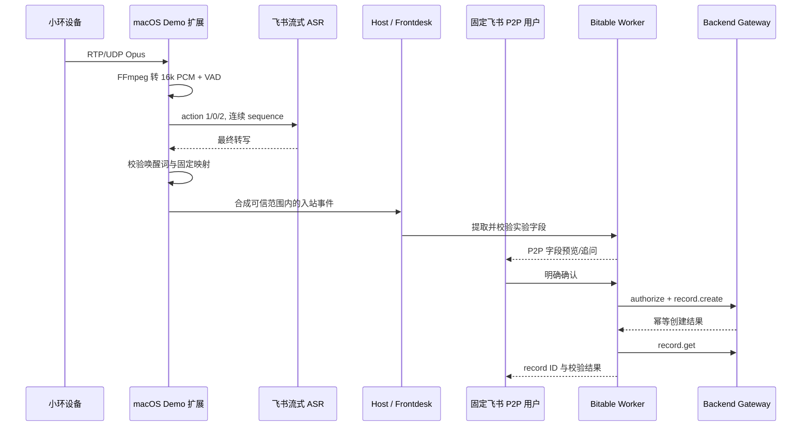

## Context

小环设备通过局域网向 macOS 发送 RTP/UDP 音频。当前演示环境的已知参数为：设备 `192.168.66.133`、接收机 `192.168.66.113`、UDP 端口 `50020`、RTP Payload Type 96、Opus CBR 64 kbps、48 kHz RTP 时钟和 20 ms 帧。VLC 已可验证端口和音频连通性，但它只适合人工诊断，且与真正接收程序不能同时占用 `50020`。

飞书流式语音识别只接受 Base64 编码的 PCM，当前接口要求 `format=pcm`、`engine_type=16k_auto`、调用方生成 16 字符流 ID，并以连续 sequence ID 和 `action=1/0/2` 表达开始、继续和正常结束。飞书建议每片 100–200 ms；租户需要高级权限 `speech_to_text:speech`，免费版不支持该 API。

平台已有 Host 侧 ChannelAdapter 扩展、飞书 P2P 投递、Frontdesk → Worker 委派、规范身份和 Backend Gateway 多维表格操作。现有多维表格 Pilot 已具备字段发现、Schema 校验、预览、明确确认、稳定幂等键、`record.create`、写后 `record.get` 与审计。本 Demo 应组合这些能力，不复制业务写入路径，也不把实验室拓扑硬编码进平台核心。

相关方包括现场演示用户、维护示例扩展的平台开发者、管理飞书应用权限与逻辑表白名单的运营者。真实用户 ID、P2P 路由、App Secret 和表标识都属于运行时配置或既有凭证边界，不得写入仓库。

## Goals / Non-Goals

**Goals:**

- 在一台 macOS 上完成单小环设备音频到最终飞书转写文本的实时闭环。
- 只让明确以配置唤醒词开头的完整话语进入现有 Agent 路由。
- 将设备输入绑定到一个运营者批准的规范用户和飞书 P2P 会话，并保留可审计来源元数据。
- 复用现有多维表格 Worker/Gateway，在字段预览和用户明确确认后恰好新增一条记录，再向用户返回校验结果。
- 对配置、网络、识别、身份和写入故障采用失败关闭策略，并避免保存原始音频。
- 以 operator-specific 示例实现，保持平台核心业务无关。

**Non-Goals:**

- 多设备、多用户动态映射、说话人识别、群聊确认或共享麦克风服务。
- 实时字幕 UI、部分识别文本驱动 Agent、音频上传、录音留存或回放。
- Record Update、Delete、Batch，或让 Agent 直接选择任意 Bitable Token/Table。
- 通用媒体网关、生产级高可用、跨主机扩缩容、复杂降噪和声学模型调优。
- 用来源 IP、音频内容、姓名、邮箱或 Agent 推断结果建立或改变平台身份。

## Decisions

### 1. 采用 fork-free 的示例 Channel 扩展

实现位于 `examples/xiaohuan-audio-demo/`，预期包含扩展清单、入口、音频接收/转换模块、飞书 ASR 客户端、配置与运行说明。扩展在 Host 侧运行，通过既有 ChannelAdapter 入口产生合成入站事件；平台核心不感知“小环”“实验记录”或固定测试用户。

选择该方案是因为音频接收属于新的 Channel ingress，而现有扩展机制可继续复用 Session 隔离、Frontdesk 委派和投递。把监听器直接写入 `src/channels/feishu` 会混淆“飞书消息来源”和“设备音频来源”；把完整 Demo 写成独立服务则会重复身份、会话和 Agent 路由。

### 2. 使用 FFmpeg 子进程解码 RTP/Opus，并在应用层切分 PCM

扩展为批准的设备和端口生成受控输入描述，启动 FFmpeg 将 RTP/Opus 48 kHz 解码、重采样为 PCM S16LE 16 kHz 单声道，并从 stdout 消费字节流。应用层把 PCM 聚合为 100–200 ms 的 ASR 分片，不依赖 VLC。启动前校验 FFmpeg 可用、端口未冲突、必要配置齐全；关闭时终止子进程并释放 socket/stream。

FFmpeg 已能处理 Opus 和重采样，减少自建 RTP jitter buffer、Opus decoder 与 native binding 的 Demo 风险。VLC 保留为人工连通性诊断工具，但正式演示前必须关闭。纯 TypeScript RTP/Opus 解码能提供更细控制，但依赖和实现量不符合最小 Demo。

### 3. 用单流能量 VAD 定义一句话

监听器持续接收音频，但同一时间最多维护一个 ASR 流。简单能量阈值开始话语，连续静音达到默认 `1200 ms` 时正常结束，单句话达到默认 `20 s` 时也结束。语音开始前只保留极短的内存预卷缓冲；识别完成或中止后立即清理 PCM 缓冲。

能量 VAD 足以验证流程，且比固定录音窗口更自然。复杂 VAD/降噪可能提高现场鲁棒性，但会增加 native 或模型依赖，留作生产化后续。

### 4. 严格实现飞书流式 ASR 状态机

每句话生成一个仅含字母、数字或下划线的 16 字符 `stream_id`。第一片使用 `sequence_id=0, action=1`，中间片递增 sequence ID 并使用 `action=0`，正常结束的最后一片使用 `action=2`；本地异常或主动放弃使用 `action=3`，且不得产生下游 Agent 事件。所有片段发送 Base64 PCM、`format=pcm` 和 `engine_type=16k_auto`。

只有正常 `action=2` 响应的最终识别文本可进入唤醒词过滤。部分/中间识别只用于内部状态，不发布到聊天、不触发 Agent。SDK 行为由封装层隔离并用模拟响应测试；真实联调需确认 `recognition_text` 是累积还是增量，但这不改变“只消费最终结果”的契约。

复用仓库已有 `@larksuiteoapi/node-sdk` 比手写认证与 HTTP 流程更小、更一致。扩展应限制单流并处理超时/限流，远低于租户全局 20 路并发上限。

### 5. 唤醒词在进入 Agent 前做确定性过滤

ASR 最终文本经首尾空白与允许的标点归一化后，必须以配置的唤醒词（默认“记录实验”）开头。匹配后只将唤醒词之后的原文作为实验描述；空内容不创建 Agent turn，并可通过 P2P 返回简短提示。未匹配的话语只记录不含原文的安全指标，不发消息、不调用 Agent。

确定性前缀比让 Agent 判断“用户是否想记录”更易演示、可测试，也避免环境谈话意外触发业务流程。连续对话和可学习唤醒词不在本 Demo 范围。

### 6. 固定映射到已批准的规范用户和飞书 P2P 路由

启用时必须配置一个规范用户 ID（例如 `feishu:ou_...`）和匹配的飞书 P2P `platformId`。扩展创建入站事件时，由运营者配置提供可信映射；设备 IP 只用于来源白名单和审计元数据，绝不派生用户。目标不是 P2P、用户不存在、路由不一致或来源 IP 不匹配时失败关闭。

事件携带安全的来源类型、capture/stream ID 和最终 transcript 元数据，Host 仍负责构造/传播可信 RequestIdentity。Demo 不绕过 Host access gate、HMAC、`origin_user_id` 或 Gateway 审计。

此方案适合固定展台，避免未经验证的设备数据冒充任意用户。生产多用户版本必须设计设备注册、所有权证明和显式身份绑定，不能延伸这条固定映射。

### 7. 通过现有 Frontdesk 和 Bitable Worker 完成确认写入

进入 Agent 的内容使用受控包装，要求从原文中提取明确出现的实验信息，不得补造缺失字段，并准备向批准的逻辑表新增一条记录。Frontdesk 继续委派给专用多维表格 Worker；Worker 通过 Gateway Describe/Field Schema 发现能力并验证字段。

字段不完整或含义不确定时，系统在固定 P2P 会话追问。字段完整后发送新增预览；只有同一 P2P 用户明确确认才调用 `record.create`。取消、超时或任何群聊响应都不得写入。Create 使用由规范用户、逻辑资源和归一化草稿派生的稳定幂等键，成功后调用 `record.get` 验证并回复 record ID/结果，审计可关联原始用户与写操作。

Demo 复用当前已实现的 Create 确认流，不依赖尚未完成的通用 Host-mediated 强确认 Broker。该取舍只接受于固定 P2P 演示；生产化应把确认绑定到不可变草稿哈希、请求者、资源和有效期。

### 8. 配置和可观测性默认安全

建议的示例配置包括：

```text
XIAOHUAN_AUDIO_DEMO_ENABLED=true
XIAOHUAN_AUDIO_PORT=50020
XIAOHUAN_AUDIO_SOURCE_IP=192.168.66.133
XIAOHUAN_DEMO_USER_ID=feishu:ou_xxx
XIAOHUAN_DEMO_PLATFORM_ID=feishu:p2p:ou_xxx
XIAOHUAN_BITABLE_RESOURCE=<approved-logical-alias>
XIAOHUAN_WAKE_PHRASE=记录实验
XIAOHUAN_SILENCE_MS=1200
XIAOHUAN_MAX_UTTERANCE_MS=20000
```

未启用时扩展不监听端口。启用但缺少必填配置、飞书 ASR 权限/租户能力、批准逻辑资源或 P2P 映射时启动失败。日志允许记录哈希化/不透明 capture ID、字节数、时长、状态和错误类别，不得记录 PCM、Base64 音频、App Secret、Token 或不受控的完整转写。现有内容采集保持关闭。

## End-to-End Flow



## Risks / Trade-offs

- [局域网 UDP 丢包或顺序抖动导致转写下降] → 使用 FFmpeg 的 RTP 处理、限制单流并暴露丢包/中止指标；现场先用 VLC/测试音频检查链路。
- [能量 VAD 在噪声环境误触发或截断] → 阈值、静音和最长时长可配置；唤醒词提供第二道门，生产化再评估 WebRTC VAD/降噪。
- [VLC 或其他进程占用 `50020`] → 启动前检测端口并给出明确错误，演示运行手册要求关闭 VLC。
- [飞书租户版本、Scope、限流或网络不可用] → 启动自检与真实预检失败关闭；ASR 错误绝不产生 Agent turn 或 Bitable 写入。
- [固定用户映射被误用于生产多用户] → 示例名称、文档与配置明确标记 demo-only；仅允许 P2P，禁止根据设备或文本扩展身份。
- [转写错误造成字段错误] → 用户在 P2P 中查看最终字段预览并确认；缺失/不确定字段必须追问，Agent 不得补造。
- [现有 Create 确认不具备生产级草稿哈希绑定] → Demo 限于单用户 P2P；在多用户/高影响部署前完成通用强确认 Broker。
- [原始音频或敏感实验信息泄漏] → PCM 仅在内存短暂存在且不写日志；转写遵循既有消息/审计策略，Gateway 审计不保存不受限单元格明文。
- [FFmpeg 子进程成为新的运行依赖] → 启动时检查版本和 codec，封装生命周期与错误，README 提供 macOS 安装/诊断步骤。

## Migration Plan

1. 先以禁用状态合入示例扩展、配置模板、模拟测试和运行手册，不改变既有 Channel 行为。
2. 运营者在测试飞书应用中确认非免费租户能力、审批 `speech_to_text:speech`，并配置批准的 Bitable 逻辑资源及固定测试用户/P2P 路由。
3. 在 macOS 安装并验证 FFmpeg，关闭 VLC，确认设备源 IP 和 UDP `50020` 可达。
4. 先运行无业务写入的 ASR 冒烟测试，再启用唤醒词到 Agent 的模拟链路，最后对测试表执行一次取消和一次确认创建。
5. 演示结束后将 `XIAOHUAN_AUDIO_DEMO_ENABLED=false` 并停止监听器；回滚只需禁用/移除示例扩展，不涉及 DB Schema 或核心协议迁移。

## Open Questions

- 演示目标 Bitable 的逻辑资源别名、必填字段和字段示例最终是什么？
- 固定测试用户的规范 user ID 与匹配 P2P platform ID 是什么？这些值只在部署时提供。
- 当前飞书租户是否已确认不是免费版，并已批准 `speech_to_text:speech`？
- SDK 的 `recognition_text` 在当前版本是增量还是累积返回？实现 spike 需要确认，但下游仍只消费正常结束的最终文本。
- 现场噪声下合适的能量阈值和预卷长度是多少？应在真实设备演练时标定默认值。

## References

- 飞书流式语音识别：<https://open.feishu.cn/document/server-docs/ai/speech_to_text-v1/stream_recognize>
- 飞书应用权限列表：<https://open.feishu.cn/document/server-docs/application-scope/scope-list?lang=zh-CN>
